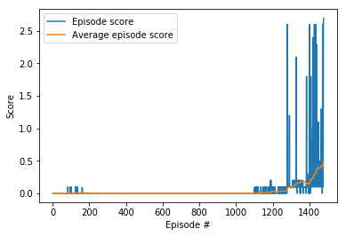

# Report

### Hyperparameters

**1. Actor network**

The neural network has two fully connected layers with uniform weight initialization. As an input it takes a state of the agent in the environment and outputs the best possible possible action given that the agent is in that very specific state (a.k.a. deterministic opitmal policy). The dimensions of the layers are:

  1st layer:
  
    - input: 24 (i.e. the dimension of the state space) 
    - activation function: rectified linear unit
    - output: 256
  
  2rd layer: 
  
    - input: 256
    - activation function: tanh
    - output: 2 (i.e. the dimension of the action space) 
    
**1. Critic network**

The neural network has four fully connected layers with uniform weight initialization. As an input it takes a state of the agent in the environment and outputs the optimal action value function by using the Actor best belevied action. The dimensions of the layers are:

  1st layer:
  
    - input: 28 (i.e. the dimension of the state space) 
    - activation function: leaky rectified linear unit
    - output: 256
  
  2nd layer:
  
    - input: 258 (its a concatenation of the output of the 1st layer and the Actor best belevied action) 
    - activation function: leaky rectified linear unit
    - output 256
   
  3nd layer:
  
    - input: 256 (its a concatenation of the output of the 1st layer and the Actor best belevied action) 
    - activation function: leaky rectified linear unit
    - output 128
  
  4rd layer: 
  
    - input: 128
    - activation function: None
    - output: 1 

**2. Learning phase** 

    replay buffer size: int(1e6) 
    minibatch size: 1024     
    discount factor: 0.99      
    tau = 1e-3  (for soft update of target parameters)
    learning rate of the Actor = 1e-4
    learning rate of the Critic = 1e-3
    L2 weights decay = 0.0

### Performance

The trend of the episode scores (defined as the maximum of the scores of the two agents) is illustrated in the plot below along with the trend of the average score over an interval of 100 consecutive episodes (if enough episodes have been gathered) or over all episodes otherwise.

