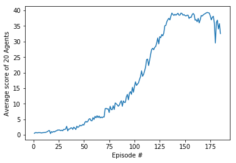

# Report

### Hyperparameters

**1. Network**

The neural network has three fully connected layers. The dimension of the layers are:

  1st layer:
  
    - input: 37 (i.e. the dimension of the state space) 
    - output: 64
  
  2nd layer:
  
    - input: 64 
    - output 64
  
  3rd layer: 
  
    - input: 64 
    - output: 4 (i.e. the dimension of the action space)

**2. Learning phase** 

    replay buffer size: int(1e5) 
    minibatch size: 32       
    discount factor: 0.99      
    tau = 1e-3  (for soft update of target parameters)
    learning rate = 5e-4               
    The network is updated after every 4 episodes

**3. Agent greediness**

    Starting epsilion: 1.0
    Ending epsilion: 0.01
    Epsilon decay rate: 0.001

### Performance

The model was trained over 2000 episodes. The trand of the average scores is illustrated in the plot below:

### Ideas for Future Work

Further hyperparameters optimizations could lead to better performances. Moreover, possible alternative algorithm could be 
[PPO](https://arxiv.org/abs/1707.06347), [A3C](https://arxiv.org/abs/1602.01783), and [D4PG](https://arxiv.org/abs/1804.08617) 
that use multiple (non-interacting, parallel) copies of the same agent to distribute the task of gathering experience.
