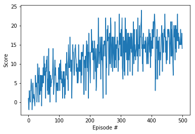

# Report

### Hyperparameters

**1. Network**

The neural network has three fully connected layers. The dimension of the layers are:

  1st layer:
  
    - input: 37 (i.e. the dimension of the state space) 
    - output: 64
  
  2nd layer:
  
    - input: 64 
    - output 64
  
  3rd layer: 
  
    - input: 64 
    - output: 4 (i.e. the dimension of the action space)

**2. Learning phase** 

    replay buffer size: int(1e5) 
    minibatch size: 64       
    discount factor: 0.99      
    tau = 1e-3  (for soft update of target parameters)
    learning rate = 5e-4               
    The network is updated after every 4 episodes

**3. Agent greediness**

    Starting epsilion: 1.0
    Ending epsilion: 0.01
    Epsilon decay rate: 0.999

### Performance

The model was trained over 2000 episodes. The trand of the average scores is illustrated in the plot below:

The average scores, during the training phase, were:

  Episode 100	Average Score: 0.80
  Episode 200	Average Score: 4.49
  Episode 300	Average Score: 7.28
  Episode 400	Average Score: 11.28
  Episode 500	Average Score: 12.90
  Episode 600	Average Score: 13.95
  Episode 700	Average Score: 14.09
  Episode 800	Average Score: 14.52
  Episode 900	Average Score: 14.59
  Episode 1000	Average Score: 15.62
  Episode 1100	Average Score: 15.59
  Episode 1200	Average Score: 15.88
  Episode 1300	Average Score: 15.74
  Episode 1400	Average Score: 16.49
  Episode 1500	Average Score: 15.54
  Episode 1600	Average Score: 15.40
  Episode 1700	Average Score: 16.30
  Episode 1800	Average Score: 15.65
  Episode 1900	Average Score: 15.87
  Episode 2000	Average Score: 15.69

### Ideas for Future Work

Having said that further hyperparameters optimizations could lead to better performances, possible extension and improvement of the vanilla Deep Q Network, can be:

- [Double Deep Q Networks](https://arxiv.org/pdf/1509.06461.pdf)
- [Prioritized Experience Replay](https://arxiv.org/pdf/1511.05952.pdf)
- [Dueling Deep Q Networks](https://arxiv.org/pdf/1511.06581.pdf)
- [Distributional DQN](https://arxiv.org/pdf/1707.06887.pdf)
- [Noisy DQN](https://arxiv.org/pdf/1706.10295.pdf)
- [RAINBOW Paper](https://arxiv.org/pdf/1710.02298.pdf)

